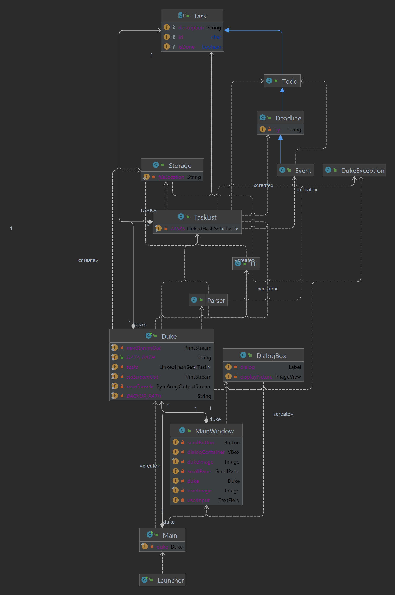
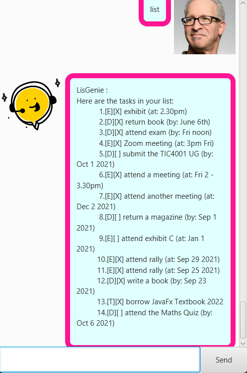

# Developer Guide

## Acknowledgements

- [Jenkov.com Tech and Media Labs JavaFx Tutorials](http://tutorials.jenkov.com/javafx/index.html) 
- [SE_EDU JavaFx tutorial](https://se-education.org/guides/tutorials/javaFx.html)
- Raoul-Gabriel Urma, Mario Fusco, Alan Mycroft, *Modern Java in Action: Lambdas, streams, functional and reactive programming 2nd Edition*, Manning, 2018. 
- Developer: **Gwee Yeu Chai**  


## Design

**LisGenie GUI App** leverages on the help of a total 13 Java classes, viz. **Duke, Parser, Task, Tasklist, Todo, Deadline, Event, Launcher, DukeException, Storage** for the 
main app logic support and **Main, MainWindow, DialogBox** for the JavaFx GUI support, together with 2 auxiliary fxml files **DialogBox.fxml and MainWindows.fxml**. Judicious use of Java API LinkedHashset<Task>'s non-duplicates properties, preserved input data order and fast location traits, for Tasks storage, allows a single user good at the keyboard to make, enquire, delete or register bookings or current status of appointments online fast.

- LisGenie Chatbot GUI V3.1 App is an extension and GUI version of the CLI app **LisGenie ChatBot Task Manager 2.0**    
- It allows for command short forms which were not available last time round
- The visual interface is designed for easy reading, and takes into considerations the computer-human interactions principles for a simple esthetic appeal of each essential
visual component affording easy usage, so user will not find using the App intimidating or boring 


## Implementation

### Integration of Duke Class with JavaFx GUI Program

#### Highlights:
1. Duke Class is modified so that all processed outputs to console are redirected to a class-level ByteArrayOutputStream _newConsole_. This affords easy 
  redirection of captured console messages into LisGenie GUI chatbox, via the _handleUserInput method_ found inside MainWindow controller Class, which handles user-cum-chatbot messages display.    
2. An instance of Duke Class is created in Main Class to load and enable the main app logic flows subsequently
3. The MainWindow Class carries a setDuke method that will create a first Greeting Message from LisGenie chatbot, upon app opening. It will handle property binding for the 
  scrollPane _vvalueProperty_ to the dialogueContainer _heightproperty_
4. Subsequently, the user will type into the textfield and either press enter or sendButton to begin conversations with the chatbot
5. All necessary JavaFx event handlers are set via the MainWindow.fxml file.
  

#### Design considerations:
Considerations in the design of app logic have been specially given to optimise operations in terms of time and space complexity wherever possible. 
In terms of class design principles, Single Responsibility Principle is adhered to rather well. This allows for strong cohesion, with minimal coupling for those
classes - especially for the seperating out of the program logic parts from the GUI parts. 

From early on, the main code base follows the Open-Closed Principle as closely as possible, as the author intends for easy refactoring and felicitous code extensions "lego-style" any time. This will save precious time and stave off headaches later on.
  
The code is kept KISS as much as possible, to keep the program flow simple and uncluttered throughout, variable names and functions method names are also rather intuitive, improving the readability for the code reader.

In a nutshell, the design patterns and principles were implemented OOP style throughout for easy scalability and modularity.
With this approach, the earlier set down framework / design policies allow for more features to be added on more rapidly while still keeping in check the complexity (such as coupling) of the application body codes.

## Product scope
**Target user profile:**

- has a need to manage a number of fast tasks management / registering
- prefer standard desktop apps vs other types
- can type fast
- prefers using the keyboard over mouse interactions
- is reasonably comfortable using CLI or GUI supported CLI apps

**Value proposition:** manage tasks additions, edits or saves faster than a typical mouse/GUI driven app


### Target user profile

Target User: Tom, 

Age: 12+ (typical)

Occupation: Student, or an adult user

Education: Secondary Level, Computer Literate

Commitments: CCAs, recreational activities, Studies or any important Work Events

Traits: Is technologically literate, active in activities, comfortable typing commands

Our example target user can be a Student that is currently schooling. As an active student, the Target User has multiple activities that may be hard to keep track of. With the scheduler, Tom will be able to plan and organize multiple appointments at the same time.


### Value proposition

LisGenie GUI Chatbot provides a user-friendly, consistent and error-free interface, as well as helpful message feedback or alerts to users, throughout the app use. The GUI Task Manager version, using the CLI-type interface with minimal GUI support, will help the user edit appointments easily with single commands entered into the textfield, or sent via a click of the sendButton provided in the opened chatbot window. Users are able to make, check, delete, view, change, and update status of tasks in real-time using this application.

Our Value Proposition is that the app provides, throughout the app use, a visually appealing and easy-to-use consistent user interface, assisting message feedbacks and or alerts fast and a capability to felicitously lead the user to his tasks with minimal cost overheads in time.


## User Stories

|Version| As a ... | I want to ... | So that I can ...|
|--------|----------|---------------|------------------|
|v1.0|new user|see help usage instructions|refer to them when I forget how to use the application (coming feature)|
|v1.0|regular user|I can add in a task entry in one line|make an entry and have it stored online fast|
|v1.0|a quick user|I can edit a booking entry description|modify an entry description easily at will (coming feature)|
|v1.0|date planner|I find a booking item by date|locate a to-do without having to go through the entire list (coming feature)|
|v1.0|systematic person|I can see my list upfront |know what tasks I have currently|
|v2.0|active student|I can update the done status of a task|check if I have done the task or not|
|v2.0|student|I can save or load at start up my tasks database|not need to re-create them everytime I start the app|
|v2.0|structured student or user|I can see my tasks as they have been entered chronologically|have a clear distinct view of the various tasks|
|v2.0|on-the-go user|I can use command short forms instead of spelling out the full command name|save time inputting lots of entries|
|v2.0|busy person|I can quit the application immediately without the need to do manual saves|move on to my other activities quickly|


## Non-Functional Requirements
1. Users are able to run the application as long as Java 11 is installed.
2. The application has been designed to handle up to 100’s of user appointments optimally, without affecting its performance.
3. The application should preferably be executable on Windows OS or compatible software-emulated terminal.
4. User-friendly features incorporated in helpful messages feedback and diagnostic prompts.
5. Enable LisGenie App window to be resizable instead of staying a fixed size (future feature). 


## LisGenie GUI App Class UML Diagram




## Glossary

* **Mainstream OS** - Windows, Linux, Unix, OS-X
* **LisGenie GUI App**  - A single-user command line app with minimal GUI support, for making, storing and managing task registration online 
* **CLI** - Command Line Interface
* **GUI** - Graphical User Interface
* **Task** - A User input string specifying the description of and or its due date of a todo, deadline or event task 
* **JavaFx** - a set of graphics and media packages that enables developers to design, create, test, debug, and deploy rich client applications that operate consistently across diverse platforms


## Instructions for manual testing

- Ensure Java jdk 11 is installed
- Download the LisGenie.jar file from Release v3.1
- Double-click on the jar file or open a terminal window and cd to the folder or location of the downloaded LisGenie.jar file and type:
```Java
`java -jar {filename}.jar`, e.g. `java -jar lisGenie.jar`
```
- Enter an App CLI command into the textbox provided, then press enter, or click the sendButton to start bot chat.
  
  
## Sample "list" instruction - GUI ChatBox Output Display:



